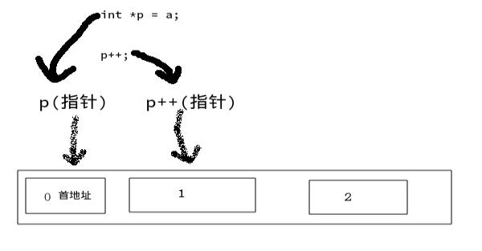

C++指针和数组的操作。

<!--more-->

C++中访问数组元素可以使用如下示例进行访问:

~~~C++
int arr[3]={0,1,2};

cout<<"第2个元素为:"<<arr[1]<<endl;
~~~

想必大家都知道输出的值为:1

---

那么我们现在可以使用指针进行访问数组元素

数组名代表的就是当前数组的第一个元素，那么我们通过让指针指向数组的数组名，即可访问数组的第一个元素。

~~~C++
int arr[3]={0,1,2};

int *p = arr;

cout<<"p:"<<*p<<endl;
~~~

输出结果为:

~~~
p:0
~~~

**提问:**

为什么指针可以指向数组名，而不需要使用引用符(&)？

**疑惑解答:**

那是因为在C++中，数组其实就是一块内存空间，然而里面的**每个元素也就组成了一块连续的内存空间**，而**数组名就当任了数组的首地址**的作用，那么它本身就是个地址，所以直接为赋值给指针没问题。

---

通过上面的疑惑解答，我们知道数组名是数组的首地址，而数组的内存空间的结构是一块连续的单元，那么我们则可以通过使用指针指向数组的数组名，再进行位偏移，这样就可以使得指针指向的是下一个单元，也就是arr[1];

~~~C++
int arr[3]={0,1,2};

int *p = arr;

//对指针进行位偏移
p++;

cout<<"p:";
~~~

输出结果:

~~~
p: 1
~~~

上述例子演示了，对指针p进行位偏移，从而使得p重新指向了一个内存单元，即&arr[1]，为何能这样使用呢？我们知道，int类型占用4个字节，而这个指针一个指向int的指针，那么对它进行++时，它所指向的位便+4个字节，那么也就是下一个内存单元&arr[1]的位置，我们通过下图更直观的查看它的变化。

---

最后利用指针遍历输出数组内的元素

~~~C++
int arr[3] = {0,1,2};

int *p = arr;

for(int i = 0;i <3;i++,p++){
  std::cout<<*p<<std::endl;
}
~~~

输出结果:

~~~
0
1
2
~~~
