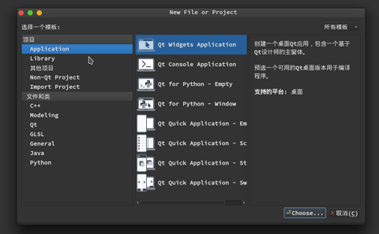

当我学习完C++的基础语法后，开始有了想制作拥有Gui界面的应用程序，所以我便选择了Qt，它具有可跨平台，并且已经有一些优质的中文教程可选．

那么就让我们从Qt5的HelloWorld开始吧!

<!--more-->

第一步先创建一个项目

可以使用快捷键 `Ctrl+N` 即可呼出创建项目的菜单

创建完成后可以看到右侧项目栏有了刚刚创建的项目，并且对不同类型的文件进行了区分

HelloWorld.pro: Qt的工程文件，由qmake处理

main.cpp: 里面就是main函数

mainwindows.cpp,mainwindows.h,mainwindows.ui这些就是我们创建项目时指定的名称。

至此，我们就可以编译并启动一个Qt5应用程序了，点击左下角的第一个绿色按钮则会进行编译运行的操作。

---

现在我们需要在窗体上放上一个标签，这里标签的内容就是HelloWorld。

修改main.cpp文件

~~~C++
#include <QApplication>
#include <QLabel>

int main(int argc, char *argv[])
{
    QApplication a(argc, argv);
    QLabel label("HelloWorld");
    label.show();

    return a.exec();
}
~~~

再编译运行，我们则可看到一个显示"HelloWorld"的窗体程序。

