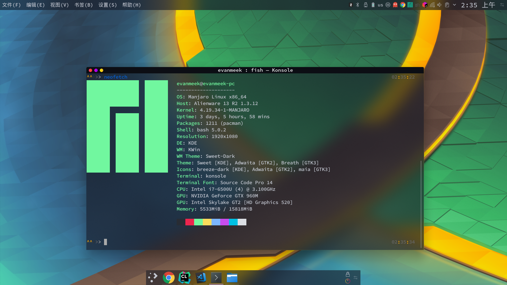
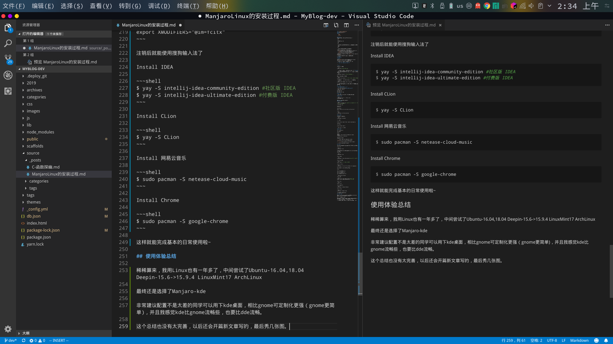

## 获取镜像
ManjaroLinux官方提供了多个桌面环境的镜像，分别是:
- XFCE 

特点

> 系统资源低耗，快速

- KDE

特点

> 高可定制化，消耗系统资源相比XFCE要大，开机时内存占用大概500MB+

- GNOME

特点

> 简单易用，可定制化，美化较为简单，内存占用大

并且ManjaroLinux在国内有4个镜像源可选，分别是:
- [清华大学](https://mirrors.tuna.tsinghua.edu.cn/manjaro-cd/)
- [中科大](http://mirrors.ustc.edu.cn/manjaro-cd/)
- [华为](https://mirrors.huaweicloud.com/manjaro-cd/)
- [浙江大学](http://mirrors.zju.edu.cn/manjaro/)

我们也可以直接使用官方的镜像源获取镜像[Manjaro](https://manjaro.org/get-manjaro/)

选择好自己要使用的桌面环境就可以开始制作启动盘了。

## 制作启动盘

**Windows:**

推荐使用[Rufus](https://github.com/pbatard/rufus/releases/download/v3.5/rufus-3.5.exe)进行制作启动盘。

下载好后直接选择镜像和要进行制作的U盘，选择开始。

**开始时会让你勾选制作方式请选择dd模式**

---

**Linux:**

只需要执行这几条命令

~~~shell
$ sudo lsblk #列出系统上的所有磁盘
~~~

找到大小磁盘大小跟你U盘差不多的那个磁盘名，一般来说都是**sdb或sda**

如果看到你的U盘对应的MOUNTPOINT有内容，就代表目前磁盘是被挂在了的，你就需要先取消挂载.

~~~shell
$ sudo umount /dev/sda* #这里的sda是你U盘的磁盘名，
~~~

取消挂载之后就可以进行格式化了.

~~~shell
$ sudo mkfs.vfat /dev/sda #注意这里没有*，并且同上一样sda是你的磁盘名.
~~~

格式化完成后，进入到你下载的镜像目录下，开始进行制作启动盘.

~~~shell
$ sudo dd bs=4M if=你的iso镜像路径 of=/dev/sda
~~~

如果终端内有一些返回信息，大概是xxMB/s这样的，就代表制作完成，可以关机已U盘启动了。

## 开始安装

**最好是在网络稳定的环境下进行**

这边只提分区，通常只需要分**根目录,主目录，引导**

引导的挂载点: /boot/efi

根目录的挂载点: /

主目录的挂载点: /home

## 设置镜像源

选择一个好的源是使用Linux体验是否良好的一个重要因素。

### 官方软件包源

~~~shell
$ sudo pacman-mirrors -i -c China -m rank
$ sudo pacman -Syu
~~~

随便选一个就好，推荐中科大的(USTC).
### Aur软件包源

~~~shell
$ sudo vim /etc/pacman.conf #不一定要使用vim，你可以使用其他编辑器，如果没有默认安装vim可以用vi

$ sudo pacman -Syu
~~~

在最后一行输入:

~~~
[archlinuxcn]
Server = https://mirrors.ustc.edu.cn/archlinuxcn/$arch
~~~

安装签名

~~~shell
$ sudo pacman -S archlinuxcn-keyring
~~~

### npm国内源

首先你得先下载npm和nodejs

~~~shell
$ sudo pacman -S npm nodejs
~~~

打开终端输入:

~~~
$ npm config set registry https://registry.npm.taobao.org
~~~

测试是否成功:

~~~
$ npm config get registry
~~~

如果看到上面这个链接就对了

### pip国内源

修改~/.pip/pip.conf

(没有则创建)

修改为:
~~~
[global]
index-url = https://pypi.tuna.tsinghua.edu.cn/simple
[install]
trusted-host=mirrors.aliyun.com
~~~

你也可以使用其他的源

[清华](https://pypi.tuna.tsinghua.edu.cn/simple)

[阿里云](http://mirrors.aliyun.com/pypi/simple/)

[中国科技大学](https://pypi.mirrors.ustc.edu.cn/simple/)

[豆瓣](http://pypi.douban.com/simple/)

## 安装软件

首先安装yay，它可以像使用pacman一样安装aur里面的软件，aur即第三方软件库

Install Yay

~~~shell
$ sudo pacman -S yay
~~~

安装Vim，VSCode，CLion，IDEA，网易云，搜狗输入法，Chrome，微信，OracleJDK8

Install Vim

~~~shell
$ sudo pacman -S Vim
~~~

Install VSCode

~~~shell
$ sudo pacman -S visual-studio-code-bin #pacman用的是vscode的二进制
~~~

Install OracleJDK8

~~~shell
$ yay -S jdk8 #这里就是由第三方打包了的
~~~

Install 搜狗输入法

~~~shell
$ sudo pacman -S fcitx-im fcitx-configtool fcitx-sogoupinyin
~~~

再编辑配置文件~/.xprofile(若没有创建即可)

修改为:

~~~
export GTK_IM_MODULE=fcitx

export QT_IM_MODULE=fcitx

export XMODIFIERS="@im=fcitx"
~~~

注销后就能使用搜狗输入法了

Install IDEA

~~~shell
$ yay -S intellij-idea-community-edition #社区版 IDEA
$ yay -S intellij-idea-ultimate-edition #付费版 IDEA
~~~

Install CLion

~~~shell
$ yay -S CLion
~~~

Install 网易云音乐

~~~shell
$ sudo pacman -S netease-cloud-music  
~~~

Install Chrome

~~~shell
$ sudo pacman -S google-chrome
~~~

这样就能完成基本的日常使用啦~

## 使用体验总结

稀稀算来，我用Linux也有一年多了，中间尝试了Ubuntu-16.04,18.04 Deepin-15.6->15.9.4 LinuxMint17 ArchLinux 

最终还是选择了Manjaro-kde

非常建议配置不是太差的同学可以用下kde桌面，相比gnome可定制化更强（gnome更简单)，并且我感觉kde比gnome流畅些，也要比dde流畅。

这个总结也没有太完善，以后还会开篇新文章写的，最后秀图。

