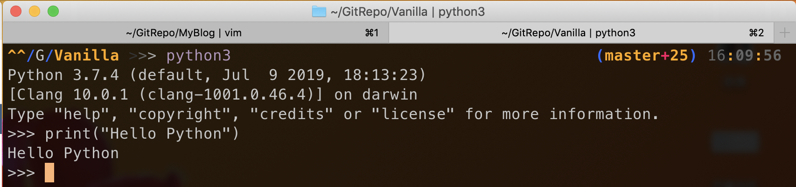

Python系列第二章笔记，查看Python系列所有文章，请点击[💿](https://evanmeek.github.io/Python/)

<!--more-->

# Mac安装Python环境

由于我目前的设备只有一台Mac Book，所以我就只记录Mac安装Python的过程。

最新的Mac OS X以及集成了Python 2，打开终端(Terminal)输入:`python`检查是否已安装


安装Python3可以在这个页面进行下载:[💿Python下载页面](https://www.python.org/downloads/)

# python不是内部或外部命令的解决方法

由于这个问题只有Windows才会出现，所以遇到问题的话，去看下原文吧[💿点我看原文解决方案](http://c.biancheng.net/view/4171.html)

# 第一个Python程序

打开终端，输入`python3`命令，进入交互式解释器

~~~
print("hello,world!")
~~~
即可输出包括在双引号之间的字符

注意点:

- 小括号与双引号必须在英文半角状态下输入

- print必须全部为小写

> 文本编辑器编写并执行Python程序

可以使用Vim编辑器编写Python源代码，然后终端中执行

注意点:

- 不要使用Word或Windows的记事本程序编写Python源码，因为这两款软件会为源代码添加隐藏符号，而这些符号不被Python所解释，程序将会报错。

# Python交互式解释器及用法

交互式解释器是为了让开发者快速学习、则是Python的功能。

在终端内执行`python`命令即可打开



其中`>>>`提示符，我们写的命令都是能被python解释器所执行的Python命令，如果输入的内容没有定义，那么解释器将会报错。

# IDE(集成开发环境)是什么

`IDE(Intergreated Development Environment)`,用来辅助开发者开发的应用软件。

集成开发环境是一些列开发工具的组合套装，例如我们编写Python程序，不仅需要解释器，而且还需要一些辅助工具，例如:语言编辑器、自动构建工具、除错器。

# Python IDE有哪些，哪款适合初学者？

首先说明，合适自己的才是最好的。

> PyCharm

由JetBrains公司开发的Python开发工具

优点:

- 跨平台

- 支持语法高粱、项目代码管理、智能提示、自动完成、调试、单元测试、版本控制等

- 支持Django Web开发框架

- 社区版本免费

缺点:

- 软件较大，比较重

- 专业版，收费

> Microsoft Visual Studio

由微软开发用于进行C#和.NET等应用的开发工具，简称VS。

要让VS支持Python，需要安装`PTVS`插件。

优点:

- PTVS插件开源

- 支持编辑、浏览、智能感知、混合Python/C++调试、Django

缺点:

- 不跨平台，只支持Windows

- 软件较大，比较重

- 非学生收费

# Python IDLE使用方法详解

由于本人不使用IDLE作为我的Python开发工具，所以这里就不提了。

想了解的，看原文[💿点击查看原文](http://c.biancheng.net/view/4221.html)

# Python注释(多行注释和单行注释)

注释是写给人看的，是用来用自然语言解释代码给开发者看的。

注释不被解释器所执行。

Python允许在任何地方差人注释和字符串，除了在标志符和字符串之间。

Python中有三种注释分别是:

> 单行注释

语法格式
~~~
# 注释内容
~~~

单行注释所在位置可以是代码的上一行，可以是当前行的末尾。

> Python多行注释

语法格式

~~~
```
注释内容
```
~~~

多行注释使用三个成对的`单引号`或三个成对的`双引号`作为多行注释块

通常用法: 为Python文件、模块、类或者函数等添加版权、功能描述等信息。

注意事项: 若多行注释作为语句的一部分(在语句中)将不会被认为是多行注释，而是Python字符串的标志。

> Python中文编码声明注释

在Python2.x中，不支持在源码中直接写中文。所以如果需要加入中文，必须在行首加上以下注释:

~~~
# coding=utf-8
~~~

Python3.x不需要

# Python缩进规则(包含快捷键)

Python采用代码缩进和冒号来区分代码块之间的层次

在Python中，类定义、函数定义、流程控制语句、异常处理语句等，行位的冒号代表代码块的开始，而同一个代码块内部代码的缩紧格式必须相同（不然Python不能知道当前代码块何时结束)，否则会出现SyntaxError

# Python编码规范

这里所提到的规范都是PEP8所定义的。

需要严格遵守的代码编写规范:

- 每个import语句只导入一个模块

~~~
# 推荐
import os
import sys

# 避免
import os sys
~~~

- 不在行尾添加分号，一行只放一条语句

~~~
# 避免
height = float(input("input height:")); weight=float(input("input weight"));
~~~

- 单行不超过80个字符，如果超过可以使用小括号将多行内容隐式的连接。

~~~
# 推荐
text=("aaaaaaaaaaaaaaaaaaaaaaaa"
"bbbbbbbbb")
~~~

- 适当使用空行，增加代码可读性

- 适当使用空格分隔运算符之间，函数之间，以及逗号两侧。

[💿PEP 8官方介绍](https://www.python.org/dev/peps/pep-0008/)

# Python标识符命名规范

Python标识符规范:

- 由字母、下划线、数字组成，但首字符不能为数字。

- 不能与Python内置的关键字相同，例如我们前面提到的import就是Python关键字。

- Python中，标识符的命名区分字母大小写。

- Python的标识符前后具有下划线代表由特殊意义。

推荐命名规范(不遵守此规范程序不会无法运行，但这基本是行业标准):

- 标识模块名时，尽量短小，由下划线分割标识符单词。

- 标识包名时，尽量短小，由英文句号作为分割。

- 标识类名时，单词首字母大写。

- 函数名、类属性，方法名，使用小写，多个单词之间使用下划线

# 编码规范的重要性

编码的规范是为了提高开发效率。

我们编码时需要遵守准则: 阅读者 > 编程者 > 机器

# Python关键字(保留字)

Python关键字是Python内置的单词，其被赋予特殊的意义。

所有的关键字表如下:

| 关键字表 |      |        |          |        |          |
|----------|------|--------|----------|--------|----------|
| and      | as   | assert | break    | class  | continue |
| def      | del  | elif   | else     | except | finally  |
| for      | from | False  | globl    | if     | import   |
| in       | is   | lambda | nonlocal | not    | None     |
| or       | pass | raise  | return   | try    | True     |
| while    | with | yield  |

# Python内置函数

Python具有内置函数，可由开发者直接调用。

有关内置函数的用法和解释可由访问[💿Python内置函数]进行查看.
