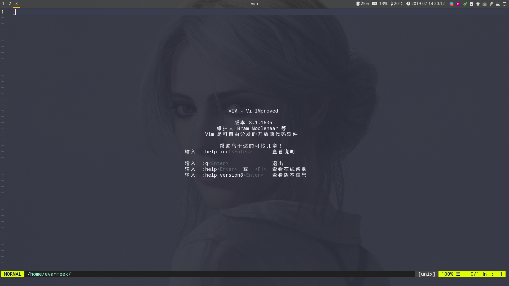

The editor I use every day is VIM.This article introduces the hirstory of the VIM.
<!--more-->

&emsp;Bram Miller __purchased__ hisr Amiga computer in the late 1980s,At this time,there is no editor vi on his computer. So he started with an open source vi __repilica__ version of Stevie，developed version 1.0 of Vim.__The initial goal__ was to completely copy the function of vi.

&emsp;After that,Vim has added countless new features. As the first milestone.version 3.0 of 1944 joined the split window mode,It can edit multiple files __simultanesouly__ in the same terminal.

&emsp;At 1996 released Vim 4.0 in 1996 using the version of the GUI.1998 Vim 5.0 version added syntax highlighting.2001 Vim 6.0 version added Code floding,Plugin,__Multi-anguage support__ ,Vertical segmentation window etc.The Vim 7.0 release was released in May 2006 added __Spell check__,__Context-sensitice completion__,__Tab editing__ etc.

&emsp;The latest version of Vim is now Vim8

