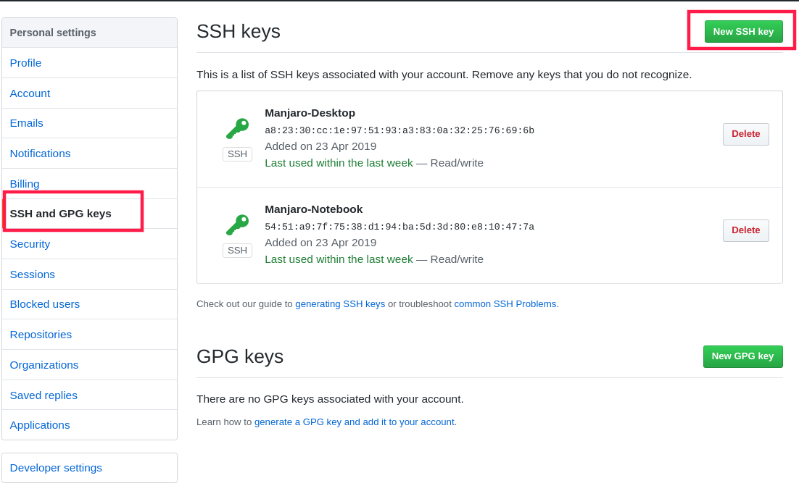

**成功搭建博客之后，想让一起学习的小伙伴也学习搭建一下，所以就有了此篇文章.**

<!--more-->

# 为何选择hexo

- hexo博客框架的网上资料较多，技术较为成熟.

- hexo使用Makrdown进行渲染.

- hexo只需几部就可部署博客.

- hexo具有丰富的主题/插件可选.

# 安装hexo

## 安装Nodejs,Git

要安装hexo必须得安装Nodejs和Git，这里只提供GNU/Linux的过程。

大部分发行版自带Git,Nodejs只需要一条命令:

**apt**

~~~shell
$ sudo apt install nodejs npm
~~~

**pacman**

~~~shell
$ sudo pacman -S nodejs npm
~~~
## 配置Nodejs

**安装完成Nodejs和Git后还需要设置npm的软件源.**

在任意目录下执行如下命令:

~~~shell
$ npm config set registry https://registry.npm.taobao.org
~~~

执行如下命令测试是否设置成功(若范围淘宝的npm镜像源地址则成功):

~~~shell
$ npm config get registry
~~~

## 配置Git

### **注册Github**

[注册Github](https://github.com/join)

### **创建仓库**

[创建Github仓库](https://github.com/new)

注意: 仓库名必须是**name.github.io**

例如我的 evanmeek.github.io

需要设置两点:

- Git身份标识

~~~shell
$ git config --global user.email "你的邮箱"
$ git config --global user.name "你的名字"
~~~

推荐把邮箱和名字设置为Github上的邮箱和名字相同

- SSH密钥

如果是第一次使用Git，那么默认是没有SSH密钥的，执行如下命令查看:

~~~shell
$ ls ~/.ssh
~~~

若没有则创建新的密钥

~~~shell
$ ssh-keygen -t rsa -C "你的邮箱"
~~~

创建密钥时会提示你输入一个密码，这样在用这里密钥时就需要输入密码，若不需要直接一路回车吧。

创建完成后，你会在~/.ssh内看到两个文件

分别是私钥(id_rsa),公钥(id_rsa.pub)

下一步则是需要在Github中添加刚刚生成的密钥

首先登陆Github,打开设置.

如图所示：

下一步找到SSH选项

如图所示：

下一步导入公钥

复制公钥的内容复制到key文本框内，Title随便写一个，可以写你的设备名

~~~shell
$ cat ~/.ssh/id_rsa.pub
~~~

## 安装hexo

前面安装完Nodejs和Git之后可以通过一条命令安装hexo

**要使用sudo提权**

执行如下命令:

~~~shell
$ npm install -g hexo-cli
~~~

看到Done!之后则为安装成功.

# 开始搭建

## 初始化hexo博客

使用如下命令初始化博客

~~~shell
$ hexo init <目录>
~~~

初始化完成之后目录结构大概是这样的:

~~~
.
├── _config.yml
├── package.json
├── scaffolds
├── source
|   ├── _drafts
|   └── _posts
└── themes
~~~

下面分别讲下这些文件或目录分别存放了些什么。

主配置文件: **_config.yml**

> 主要用于博客的配置信息，后面还会在themes里看到_config.yml，和这个不同，我们只要记住这个是博客的主配置文件.

插件信息: **package.json**

> 包含了当前hexo博客中安装了哪些插件.

模板目录: **scaffolds/**

> 里面包含了可定制的模板文件，在创建或生成新的博文时就会按照这里的模板进行渲染.

资源目录: **source/**

> 在这里包含了你的一些资源文件，例如文章源码，图片等，要注意的是_posts目录并不会在生成渲染时并不会被拷贝到public目录下.

主题目录: **themes/**

> 主题目录，所有的主题都丢在这里。

---

## 生成博客

执行如下命令创建一篇博文:

~~~shell
$ hexo n "文章名"
~~~

hexo会在source/_posts目录下创建一个markdown文档，这样就可以开始编写了!

这一步用于生成静态文件(就是把md转为html的操作)

**要在网站目录(就是初始化的目录下)下执行**

~~~shell
$ hexo generate
~~~

这个命令可以简化，并且还可以带两个参数

简化+参数:
~~~shell
$ hexo g -d # 生成+部署(也就是推送到github pages去了，你们先不要执行这一步)

$ hexo g -w # 可以监视有哪些文件被生成了
~~~

---

# 配置hexo

这里的user.email和user.name可以不是Github的邮箱或名字，但推荐设置为Github相同.

下面配置hexo，对于hexo的修改，可以通过_config.yml文件修改大多数设置。

找到deploy项

修改为:

---

## 部署博客

部署博客这里只讲两种，分别是通过Git推送到远程代码托管中心(Github)和本地部署

**本地部署**

执行如下命令:

~~~shell
$ hexo s
~~~

执行完后可以通过localhost:4000进行[查看](localhost:4000).

**部署到Github**

~~~shell
$ hexo g
~~~

这样就可以部署到Github了，通过https://你的Github用户名.github.io访问

# 寻找主题

# 第一篇博客

# 使用体验

